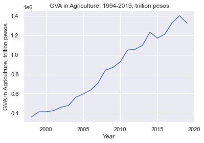
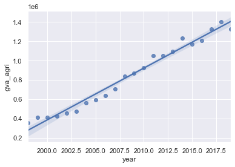
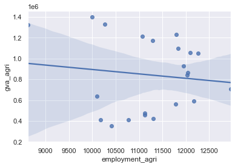
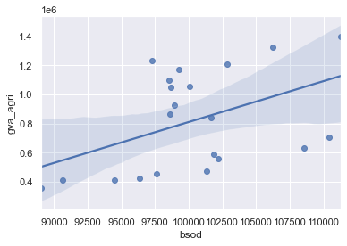
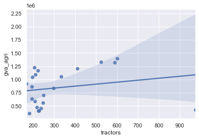
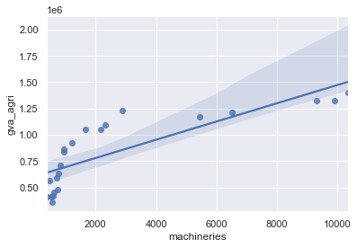

```python
import pandas as pd
import numpy as np
import matplotlib.pyplot as plt
# import statsmodel to run regression
import statsmodels.formula.api as sm
import seaborn as sns
# set sns layout
sns.set(style="darkgrid")
```


```python
# read data from csv file
# the invalid_values are values that need to be treated as missing values
invalid_values = ['-',' -   ']

csv_data = pd.read_csv('modeling.csv', na_values=invalid_values)
```


```python
# assign csv_data to data frame var named 'df'
df = pd.DataFrame(csv_data)
```


```python
# show some data
print('First 5 rows')
df.head()
```


<div>
<style scoped>
    .dataframe tbody tr th:only-of-type {
        vertical-align: middle;
    }

    .dataframe tbody tr th {
        vertical-align: top;
    }

    .dataframe thead th {
        text-align: right;
    }
</style>
<table border="1" class="dataframe">
  <thead>
    <tr style="text-align: right;">
      <th></th>
      <th>id</th>
      <th>year</th>
      <th>gva_agri</th>
      <th>employment_agri</th>
      <th>bsod</th>
      <th>machineries</th>
      <th>tractors</th>
      <th>dcf_total</th>
      <th>tfp</th>
      <th>exp_irrigation</th>
      <th>...</th>
      <th>exp_pss</th>
      <th>exp_mds</th>
      <th>exp_esets</th>
      <th>cpi</th>
      <th>def_irrigation</th>
      <th>def_postharvest</th>
      <th>def_rd</th>
      <th>def_pss</th>
      <th>def_mds</th>
      <th>def_esets</th>
    </tr>
  </thead>
  <tbody>
    <tr>
      <th>0</th>
      <td>1</td>
      <td>1971</td>
      <td>NaN</td>
      <td>6321</td>
      <td>NaN</td>
      <td>NaN</td>
      <td>NaN</td>
      <td>NaN</td>
      <td>NaN</td>
      <td>NaN</td>
      <td>...</td>
      <td>NaN</td>
      <td>NaN</td>
      <td>NaN</td>
      <td>NaN</td>
      <td>NaN</td>
      <td>NaN</td>
      <td>NaN</td>
      <td>NaN</td>
      <td>NaN</td>
      <td>NaN</td>
    </tr>
    <tr>
      <th>1</th>
      <td>2</td>
      <td>1972</td>
      <td>NaN</td>
      <td>6863</td>
      <td>NaN</td>
      <td>NaN</td>
      <td>NaN</td>
      <td>NaN</td>
      <td>NaN</td>
      <td>NaN</td>
      <td>...</td>
      <td>NaN</td>
      <td>NaN</td>
      <td>NaN</td>
      <td>NaN</td>
      <td>NaN</td>
      <td>NaN</td>
      <td>NaN</td>
      <td>NaN</td>
      <td>NaN</td>
      <td>NaN</td>
    </tr>
    <tr>
      <th>2</th>
      <td>3</td>
      <td>1973</td>
      <td>NaN</td>
      <td>7766</td>
      <td>NaN</td>
      <td>NaN</td>
      <td>NaN</td>
      <td>NaN</td>
      <td>NaN</td>
      <td>NaN</td>
      <td>...</td>
      <td>NaN</td>
      <td>NaN</td>
      <td>NaN</td>
      <td>NaN</td>
      <td>NaN</td>
      <td>NaN</td>
      <td>NaN</td>
      <td>NaN</td>
      <td>NaN</td>
      <td>NaN</td>
    </tr>
    <tr>
      <th>3</th>
      <td>4</td>
      <td>1974</td>
      <td>NaN</td>
      <td>7684</td>
      <td>NaN</td>
      <td>NaN</td>
      <td>NaN</td>
      <td>NaN</td>
      <td>NaN</td>
      <td>NaN</td>
      <td>...</td>
      <td>NaN</td>
      <td>NaN</td>
      <td>NaN</td>
      <td>NaN</td>
      <td>NaN</td>
      <td>NaN</td>
      <td>NaN</td>
      <td>NaN</td>
      <td>NaN</td>
      <td>NaN</td>
    </tr>
    <tr>
      <th>4</th>
      <td>5</td>
      <td>1973</td>
      <td>NaN</td>
      <td>7766</td>
      <td>NaN</td>
      <td>NaN</td>
      <td>NaN</td>
      <td>NaN</td>
      <td>NaN</td>
      <td>NaN</td>
      <td>...</td>
      <td>NaN</td>
      <td>NaN</td>
      <td>NaN</td>
      <td>NaN</td>
      <td>NaN</td>
      <td>NaN</td>
      <td>NaN</td>
      <td>NaN</td>
      <td>NaN</td>
      <td>NaN</td>
    </tr>
  </tbody>
</table>
<p>5 rows × 23 columns</p>
</div>


```python
print('Last 5 rows')
df.tail()
```


<div>
<style scoped>
    .dataframe tbody tr th:only-of-type {
        vertical-align: middle;
    }

    .dataframe tbody tr th {
        vertical-align: top;
    }

    .dataframe thead th {
        text-align: right;
    }
</style>
<table border="1" class="dataframe">
  <thead>
    <tr style="text-align: right;">
      <th></th>
      <th>id</th>
      <th>year</th>
      <th>gva_agri</th>
      <th>employment_agri</th>
      <th>bsod</th>
      <th>machineries</th>
      <th>tractors</th>
      <th>dcf_total</th>
      <th>tfp</th>
      <th>exp_irrigation</th>
      <th>...</th>
      <th>exp_pss</th>
      <th>exp_mds</th>
      <th>exp_esets</th>
      <th>cpi</th>
      <th>def_irrigation</th>
      <th>def_postharvest</th>
      <th>def_rd</th>
      <th>def_pss</th>
      <th>def_mds</th>
      <th>def_esets</th>
    </tr>
  </thead>
  <tbody>
    <tr>
      <th>45</th>
      <td>46</td>
      <td>2015</td>
      <td>1170256.0</td>
      <td>11294</td>
      <td>99286.0</td>
      <td>5444.0</td>
      <td>221.0</td>
      <td>104952.0</td>
      <td>1054011.0</td>
      <td>1496.0</td>
      <td>...</td>
      <td>5504.0</td>
      <td>214.0</td>
      <td>2212.0</td>
      <td>107.0</td>
      <td>14.0</td>
      <td>29.0</td>
      <td>12.0</td>
      <td>51.0</td>
      <td>2.0</td>
      <td>21.0</td>
    </tr>
    <tr>
      <th>46</th>
      <td>47</td>
      <td>2016</td>
      <td>1210438.0</td>
      <td>11064</td>
      <td>102845.0</td>
      <td>6524.0</td>
      <td>410.0</td>
      <td>109779.0</td>
      <td>1089595.0</td>
      <td>1355.0</td>
      <td>...</td>
      <td>6311.0</td>
      <td>158.0</td>
      <td>2081.0</td>
      <td>108.0</td>
      <td>13.0</td>
      <td>27.0</td>
      <td>11.0</td>
      <td>58.0</td>
      <td>1.0</td>
      <td>19.0</td>
    </tr>
    <tr>
      <th>47</th>
      <td>48</td>
      <td>2017</td>
      <td>1327952.0</td>
      <td>10261</td>
      <td>106255.0</td>
      <td>9907.0</td>
      <td>524.0</td>
      <td>116686.0</td>
      <td>1201005.0</td>
      <td>3292.0</td>
      <td>...</td>
      <td>6527.0</td>
      <td>163.0</td>
      <td>3180.0</td>
      <td>112.0</td>
      <td>30.0</td>
      <td>40.0</td>
      <td>11.0</td>
      <td>59.0</td>
      <td>1.0</td>
      <td>29.0</td>
    </tr>
    <tr>
      <th>48</th>
      <td>49</td>
      <td>2018</td>
      <td>1400390.0</td>
      <td>9998</td>
      <td>111286.0</td>
      <td>10355.0</td>
      <td>600.0</td>
      <td>122240.0</td>
      <td>1268152.0</td>
      <td>2637.0</td>
      <td>...</td>
      <td>8504.0</td>
      <td>187.0</td>
      <td>3246.0</td>
      <td>117.0</td>
      <td>22.0</td>
      <td>37.0</td>
      <td>12.0</td>
      <td>73.0</td>
      <td>2.0</td>
      <td>28.0</td>
    </tr>
    <tr>
      <th>49</th>
      <td>50</td>
      <td>2019</td>
      <td>1323806.0</td>
      <td>8622</td>
      <td>NaN</td>
      <td>9299.0</td>
      <td>589.0</td>
      <td>9888.0</td>
      <td>1305296.0</td>
      <td>NaN</td>
      <td>...</td>
      <td>NaN</td>
      <td>NaN</td>
      <td>NaN</td>
      <td>120.0</td>
      <td>NaN</td>
      <td>NaN</td>
      <td>NaN</td>
      <td>NaN</td>
      <td>NaN</td>
      <td>NaN</td>
    </tr>
  </tbody>
</table>
<p>5 rows × 23 columns</p>
</div>


```python
# check data types
print('Check the datatypes')
df.dtypes
```


    id                   int64
    year                 int64
    gva_agri           float64
    employment_agri      int64
    bsod               float64
    machineries        float64
    tractors           float64
    dcf_total          float64
    tfp                float64
    exp_irrigation     float64
    exp_postharvest    float64
    exp_other_infra    float64
    exp_rd             float64
    exp_pss            float64
    exp_mds            float64
    exp_esets          float64
    cpi                float64
    def_irrigation     float64
    def_postharvest    float64
    def_rd             float64
    def_pss            float64
    def_mds            float64
    def_esets          float64
    dtype: object


```python
# change data type
df['def_irrigation'] = df['def_irrigation'].astype('float64')
df['def_postharvest'] = df['def_postharvest'].astype('float64')
# df.dtypes
```


    id                   int64
    year                 int64
    gva_agri           float64
    employment_agri      int64
    bsod               float64
    machineries        float64
    tractors           float64
    dcf_total          float64
    tfp                float64
    exp_irrigation     float64
    exp_postharvest    float64
    exp_other_infra    float64
    exp_rd             float64
    exp_pss            float64
    exp_mds            float64
    exp_esets          float64
    cpi                float64
    def_irrigation     float64
    def_postharvest    float64
    def_rd             float64
    def_pss            float64
    def_mds            float64
    def_esets          float64
    dtype: object


```python
print('Summary of the data')
df.describe()
```


<div>
<style scoped>
    .dataframe tbody tr th:only-of-type {
        vertical-align: middle;
    }

    .dataframe tbody tr th {
        vertical-align: top;
    }

    .dataframe thead th {
        text-align: right;
    }
</style>
<table border="1" class="dataframe">
  <thead>
    <tr style="text-align: right;">
      <th></th>
      <th>id</th>
      <th>year</th>
      <th>gva_agri</th>
      <th>employment_agri</th>
      <th>bsod</th>
      <th>machineries</th>
      <th>tractors</th>
      <th>dcf_total</th>
      <th>tfp</th>
      <th>exp_irrigation</th>
      <th>...</th>
      <th>exp_pss</th>
      <th>exp_mds</th>
      <th>exp_esets</th>
      <th>cpi</th>
      <th>def_irrigation</th>
      <th>def_postharvest</th>
      <th>def_rd</th>
      <th>def_pss</th>
      <th>def_mds</th>
      <th>def_esets</th>
    </tr>
  </thead>
  <tbody>
    <tr>
      <th>count</th>
      <td>50.00000</td>
      <td>50.000000</td>
      <td>2.200000e+01</td>
      <td>50.000000</td>
      <td>21.000000</td>
      <td>22.000000</td>
      <td>22.000000</td>
      <td>22.000000</td>
      <td>2.200000e+01</td>
      <td>18.000000</td>
      <td>...</td>
      <td>18.000000</td>
      <td>18.000000</td>
      <td>18.000000</td>
      <td>26.000000</td>
      <td>18.000000</td>
      <td>18.000000</td>
      <td>18.000000</td>
      <td>18.000000</td>
      <td>18.000000</td>
      <td>18.000000</td>
    </tr>
    <tr>
      <th>mean</th>
      <td>25.50000</td>
      <td>1994.460000</td>
      <td>8.421958e+05</td>
      <td>10166.200000</td>
      <td>100288.904762</td>
      <td>2719.772727</td>
      <td>313.500000</td>
      <td>98763.545455</td>
      <td>7.321964e+05</td>
      <td>4399.166667</td>
      <td>...</td>
      <td>4188.666667</td>
      <td>145.388889</td>
      <td>1791.444444</td>
      <td>79.461538</td>
      <td>58.777778</td>
      <td>30.277778</td>
      <td>10.277778</td>
      <td>45.944444</td>
      <td>1.666667</td>
      <td>20.277778</td>
    </tr>
    <tr>
      <th>std</th>
      <td>14.57738</td>
      <td>14.606694</td>
      <td>3.520185e+05</td>
      <td>1624.039446</td>
      <td>5649.100901</td>
      <td>3306.948729</td>
      <td>196.905283</td>
      <td>21212.621875</td>
      <td>3.541838e+05</td>
      <td>4317.066368</td>
      <td>...</td>
      <td>2142.009172</td>
      <td>70.075706</td>
      <td>868.515652</td>
      <td>25.227336</td>
      <td>64.496745</td>
      <td>14.364194</td>
      <td>6.066354</td>
      <td>19.114122</td>
      <td>0.907485</td>
      <td>10.637368</td>
    </tr>
    <tr>
      <th>min</th>
      <td>1.00000</td>
      <td>1971.000000</td>
      <td>3.562110e+05</td>
      <td>6321.000000</td>
      <td>89050.000000</td>
      <td>385.000000</td>
      <td>167.000000</td>
      <td>9888.000000</td>
      <td>2.559960e+05</td>
      <td>209.000000</td>
      <td>...</td>
      <td>1811.000000</td>
      <td>22.000000</td>
      <td>491.000000</td>
      <td>39.000000</td>
      <td>2.000000</td>
      <td>4.000000</td>
      <td>3.000000</td>
      <td>25.000000</td>
      <td>0.000000</td>
      <td>7.000000</td>
    </tr>
    <tr>
      <th>25%</th>
      <td>13.25000</td>
      <td>1982.250000</td>
      <td>4.975822e+05</td>
      <td>9302.250000</td>
      <td>97629.000000</td>
      <td>637.000000</td>
      <td>205.500000</td>
      <td>98792.500000</td>
      <td>3.838205e+05</td>
      <td>1284.500000</td>
      <td>...</td>
      <td>2477.000000</td>
      <td>88.750000</td>
      <td>964.750000</td>
      <td>59.750000</td>
      <td>12.250000</td>
      <td>25.250000</td>
      <td>6.250000</td>
      <td>30.250000</td>
      <td>1.000000</td>
      <td>11.000000</td>
    </tr>
    <tr>
      <th>50%</th>
      <td>25.50000</td>
      <td>1994.500000</td>
      <td>8.540590e+05</td>
      <td>10332.000000</td>
      <td>99286.000000</td>
      <td>950.000000</td>
      <td>225.500000</td>
      <td>101707.000000</td>
      <td>7.406940e+05</td>
      <td>2964.500000</td>
      <td>...</td>
      <td>3786.500000</td>
      <td>156.500000</td>
      <td>1932.000000</td>
      <td>78.000000</td>
      <td>26.000000</td>
      <td>28.500000</td>
      <td>8.500000</td>
      <td>40.500000</td>
      <td>2.000000</td>
      <td>18.500000</td>
    </tr>
    <tr>
      <th>75%</th>
      <td>37.75000</td>
      <td>2006.750000</td>
      <td>1.151675e+06</td>
      <td>11298.500000</td>
      <td>102205.000000</td>
      <td>2740.500000</td>
      <td>323.500000</td>
      <td>104447.250000</td>
      <td>1.036260e+06</td>
      <td>6759.250000</td>
      <td>...</td>
      <td>5398.000000</td>
      <td>199.000000</td>
      <td>2249.500000</td>
      <td>102.250000</td>
      <td>86.500000</td>
      <td>32.750000</td>
      <td>11.750000</td>
      <td>56.250000</td>
      <td>2.000000</td>
      <td>27.250000</td>
    </tr>
    <tr>
      <th>max</th>
      <td>50.00000</td>
      <td>2019.000000</td>
      <td>1.400390e+06</td>
      <td>12960.000000</td>
      <td>111286.000000</td>
      <td>10355.000000</td>
      <td>975.000000</td>
      <td>122240.000000</td>
      <td>1.305296e+06</td>
      <td>13240.000000</td>
      <td>...</td>
      <td>8504.000000</td>
      <td>267.000000</td>
      <td>3246.000000</td>
      <td>120.000000</td>
      <td>206.000000</td>
      <td>74.000000</td>
      <td>27.000000</td>
      <td>94.000000</td>
      <td>4.000000</td>
      <td>42.000000</td>
    </tr>
  </tbody>
</table>
<p>8 rows × 23 columns</p>
</div>


```python
# define x and y
y = df['gva_agri']
x = df['year']
```


```python
print('Plot dependent variable over the years')
plt.plot(x, y)
plt.xlabel('Year')
plt.ylabel('GVA in Agriculture, trillion pesos')
plt.title('GVA in Agriculture, 1994-2019, trillion pesos')
plt.show()
```





```python
new_df = df.loc[df['year'] > 1997]
```


```python
# describe the new data
print('Retrieve sample data for 1997-2019 since some data are missing from previous years')
new_df.describe()
```


<div>
<style scoped>
    .dataframe tbody tr th:only-of-type {
        vertical-align: middle;
    }

    .dataframe tbody tr th {
        vertical-align: top;
    }

    .dataframe thead th {
        text-align: right;
    }
</style>
<table border="1" class="dataframe">
  <thead>
    <tr style="text-align: right;">
      <th></th>
      <th>id</th>
      <th>year</th>
      <th>gva_agri</th>
      <th>employment_agri</th>
      <th>bsod</th>
      <th>machineries</th>
      <th>tractors</th>
      <th>dcf_total</th>
      <th>tfp</th>
      <th>exp_irrigation</th>
      <th>...</th>
      <th>exp_pss</th>
      <th>exp_mds</th>
      <th>exp_esets</th>
      <th>cpi</th>
      <th>def_irrigation</th>
      <th>def_postharvest</th>
      <th>def_rd</th>
      <th>def_pss</th>
      <th>def_mds</th>
      <th>def_esets</th>
    </tr>
  </thead>
  <tbody>
    <tr>
      <th>count</th>
      <td>22.000000</td>
      <td>22.000000</td>
      <td>2.200000e+01</td>
      <td>22.000000</td>
      <td>21.000000</td>
      <td>22.000000</td>
      <td>22.000000</td>
      <td>22.000000</td>
      <td>2.200000e+01</td>
      <td>18.000000</td>
      <td>...</td>
      <td>18.000000</td>
      <td>18.000000</td>
      <td>18.000000</td>
      <td>22.0000</td>
      <td>18.000000</td>
      <td>18.000000</td>
      <td>18.000000</td>
      <td>18.000000</td>
      <td>18.000000</td>
      <td>18.000000</td>
    </tr>
    <tr>
      <th>mean</th>
      <td>39.500000</td>
      <td>2008.500000</td>
      <td>8.421958e+05</td>
      <td>11235.863636</td>
      <td>100288.904762</td>
      <td>2719.772727</td>
      <td>313.500000</td>
      <td>98763.545455</td>
      <td>7.321964e+05</td>
      <td>4399.166667</td>
      <td>...</td>
      <td>4188.666667</td>
      <td>145.388889</td>
      <td>1791.444444</td>
      <td>86.0000</td>
      <td>58.777778</td>
      <td>30.277778</td>
      <td>10.277778</td>
      <td>45.944444</td>
      <td>1.666667</td>
      <td>20.277778</td>
    </tr>
    <tr>
      <th>std</th>
      <td>6.493587</td>
      <td>6.493587</td>
      <td>3.520185e+05</td>
      <td>1002.678855</td>
      <td>5649.100901</td>
      <td>3306.948729</td>
      <td>196.905283</td>
      <td>21212.621875</td>
      <td>3.541838e+05</td>
      <td>4317.066368</td>
      <td>...</td>
      <td>2142.009172</td>
      <td>70.075706</td>
      <td>868.515652</td>
      <td>21.5495</td>
      <td>64.496745</td>
      <td>14.364194</td>
      <td>6.066354</td>
      <td>19.114122</td>
      <td>0.907485</td>
      <td>10.637368</td>
    </tr>
    <tr>
      <th>min</th>
      <td>29.000000</td>
      <td>1998.000000</td>
      <td>3.562110e+05</td>
      <td>8622.000000</td>
      <td>89050.000000</td>
      <td>385.000000</td>
      <td>167.000000</td>
      <td>9888.000000</td>
      <td>2.559960e+05</td>
      <td>209.000000</td>
      <td>...</td>
      <td>1811.000000</td>
      <td>22.000000</td>
      <td>491.000000</td>
      <td>52.0000</td>
      <td>2.000000</td>
      <td>4.000000</td>
      <td>3.000000</td>
      <td>25.000000</td>
      <td>0.000000</td>
      <td>7.000000</td>
    </tr>
    <tr>
      <th>25%</th>
      <td>34.250000</td>
      <td>2003.250000</td>
      <td>4.975822e+05</td>
      <td>10504.000000</td>
      <td>97629.000000</td>
      <td>637.000000</td>
      <td>205.500000</td>
      <td>98792.500000</td>
      <td>3.838205e+05</td>
      <td>1284.500000</td>
      <td>...</td>
      <td>2477.000000</td>
      <td>88.750000</td>
      <td>964.750000</td>
      <td>65.7500</td>
      <td>12.250000</td>
      <td>25.250000</td>
      <td>6.250000</td>
      <td>30.250000</td>
      <td>1.000000</td>
      <td>11.000000</td>
    </tr>
    <tr>
      <th>50%</th>
      <td>39.500000</td>
      <td>2008.500000</td>
      <td>8.540590e+05</td>
      <td>11297.000000</td>
      <td>99286.000000</td>
      <td>950.000000</td>
      <td>225.500000</td>
      <td>101707.000000</td>
      <td>7.406940e+05</td>
      <td>2964.500000</td>
      <td>...</td>
      <td>3786.500000</td>
      <td>156.500000</td>
      <td>1932.000000</td>
      <td>87.5000</td>
      <td>26.000000</td>
      <td>28.500000</td>
      <td>8.500000</td>
      <td>40.500000</td>
      <td>2.000000</td>
      <td>18.500000</td>
    </tr>
    <tr>
      <th>75%</th>
      <td>44.750000</td>
      <td>2013.750000</td>
      <td>1.151675e+06</td>
      <td>12011.500000</td>
      <td>102205.000000</td>
      <td>2740.500000</td>
      <td>323.500000</td>
      <td>104447.250000</td>
      <td>1.036260e+06</td>
      <td>6759.250000</td>
      <td>...</td>
      <td>5398.000000</td>
      <td>199.000000</td>
      <td>2249.500000</td>
      <td>105.2500</td>
      <td>86.500000</td>
      <td>32.750000</td>
      <td>11.750000</td>
      <td>56.250000</td>
      <td>2.000000</td>
      <td>27.250000</td>
    </tr>
    <tr>
      <th>max</th>
      <td>50.000000</td>
      <td>2019.000000</td>
      <td>1.400390e+06</td>
      <td>12960.000000</td>
      <td>111286.000000</td>
      <td>10355.000000</td>
      <td>975.000000</td>
      <td>122240.000000</td>
      <td>1.305296e+06</td>
      <td>13240.000000</td>
      <td>...</td>
      <td>8504.000000</td>
      <td>267.000000</td>
      <td>3246.000000</td>
      <td>120.0000</td>
      <td>206.000000</td>
      <td>74.000000</td>
      <td>27.000000</td>
      <td>94.000000</td>
      <td>4.000000</td>
      <td>42.000000</td>
    </tr>
  </tbody>
</table>
<p>8 rows × 23 columns</p>
</div>


```python
# define the ols
result = sm.ols(formula='gva_agri ~ year + employment_agri + bsod + machineries + tractors',data=new_df).fit()
```


```python
print('Result of regression analysis')
print(result.summary())
```

                                OLS Regression Results                            
    ==============================================================================
    Dep. Variable:               gva_agri   R-squared:                       0.989
    Model:                            OLS   Adj. R-squared:                  0.985
    Method:                 Least Squares   F-statistic:                     259.3
    Date:                Sun, 24 May 2020   Prob (F-statistic):           5.25e-14
    Time:                        10:39:02   Log-Likelihood:                -250.03
    No. Observations:                  21   AIC:                             512.1
    Df Residuals:                      15   BIC:                             518.3
    Df Model:                           5                                         
    Covariance Type:            nonrobust                                         
    ===================================================================================
                          coef    std err          t      P>|t|      [0.025      0.975]
    -----------------------------------------------------------------------------------
    Intercept       -1.101e+08   8.03e+06    -13.710      0.000   -1.27e+08    -9.3e+07
    year             5.561e+04   4101.180     13.559      0.000    4.69e+04    6.43e+04
    employment_agri     2.3672     19.165      0.124      0.903     -38.481      43.215
    bsod               -7.3198      2.042     -3.584      0.003     -11.673      -2.967
    machineries         7.2302      9.505      0.761      0.459     -13.028      27.489
    tractors           -8.9788     59.359     -0.151      0.882    -135.501     117.543
    ==============================================================================
    Omnibus:                        0.905   Durbin-Watson:                   1.522
    Prob(Omnibus):                  0.636   Jarque-Bera (JB):                0.785
    Skew:                          -0.186   Prob(JB):                        0.675
    Kurtosis:                       2.129   Cond. No.                     8.78e+07
    ==============================================================================
    
    Warnings:
    [1] Standard Errors assume that the covariance matrix of the errors is correctly specified.
    [2] The condition number is large, 8.78e+07. This might indicate that there are
    strong multicollinearity or other numerical problems.
    


```python
# x and y corresponds to name of column, which is mapped to the dataset
def plot(x, y):
    sns.regplot(x, y, data=new_df)
    plt.show(sns)
```


```python
print('GVA agri vs Year')
plot('year','gva_agri')
```





```python
print('GVA agri vs Employment in agri')
plot('employment_agri','gva_agri')
```





```python
print('GVA agri vs BSOD')
plot('bsod','gva_agri')
```





```python
print('GVA agri vs Tractors')
plot('tractors','gva_agri')
```





```python
print('GVA agri vs Machineries')
plot('machineries','gva_agri')
```





```python

```
